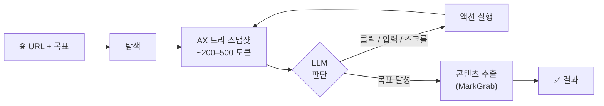
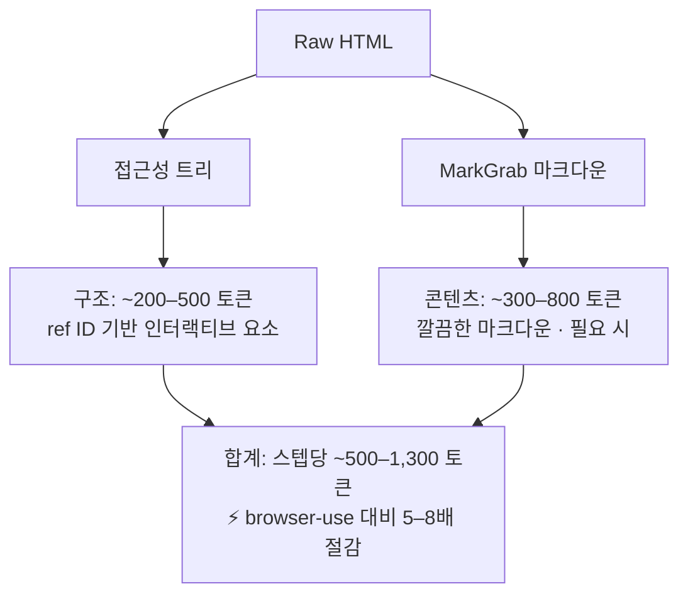

# browsegrab

> [English](README.md)

> 로컬 LLM을 위한 토큰 효율적 브라우저 에이전트 — Playwright + 접근성 트리 + MarkGrab, MCP 네이티브.

**browsegrab**은 로컬 LLM(8B-35B 파라미터)을 위해 설계된 경량 브라우저 자동화 라이브러리입니다. Playwright의 접근성 트리와 [MarkGrab](https://github.com/QuartzUnit/markgrab)의 HTML→마크다운 변환을 결합하여 browser-use 대비 **스텝당 5-8배 적은 토큰**을 사용합니다.

## 기능

- **토큰 효율적**: 스텝당 ~500-1,500 토큰 (browser-use는 4,000-10,000)
- **로컬 LLM 우선**: vLLM, Ollama, OpenAI 호환 엔드포인트에 최적화
- **MCP 네이티브**: 8개 브라우저 자동화 도구를 갖춘 내장 MCP 서버
- **MarkGrab 통합**: HTML → 깔끔한 마크다운 콘텐츠 추출
- **접근성 트리 + ref 시스템**: 비전 모델 없이 안정적 요소 참조 (`e1`, `e2`, ...)
- **성공 패턴 캐싱**: 반복 워크플로우에서 LLM 호출 제로
- **5단계 JSON 파서**: 로컬 LLM 출력을 위한 견고한 액션 파싱
- **최소 의존성**: 코어에 `playwright` + `httpx`만 필요

## 설치

```bash
pip install browsegrab
playwright install chromium
```

선택적 기능:

```bash
pip install browsegrab[mcp]      # MCP 서버 지원
pip install browsegrab[content]  # MarkGrab 콘텐츠 추출
pip install browsegrab[cli]      # rich 출력 CLI
pip install browsegrab[all]      # 전체
```

## 빠른 시작

### Python API

```python
from browsegrab import BrowseSession

async with BrowseSession() as session:
    # 탐색 + 접근성 트리 스냅샷
    await session.navigate("https://example.com")
    snap = await session.snapshot()
    print(snap.tree_text)
    # - heading "Example Domain" [level=1]
    # - link "Learn more": [ref=e1]

    # ref ID로 클릭
    result = await session.click("e1")
    print(result.url)  # https://www.iana.org/help/example-domains

    # 검색창에 입력
    await session.navigate("https://en.wikipedia.org")
    snap = await session.snapshot()
    await session.type("e4", "Python programming", submit=True)

    # 압축된 콘텐츠 추출 (AX 트리 + 마크다운)
    content = await session.extract_content()
```

### CLI

```bash
# 접근성 트리 스냅샷
browsegrab snapshot https://example.com

# JSON 출력
browsegrab snapshot https://example.com -f json

# 콘텐츠 추출 (AX 트리 + 마크다운)
browsegrab extract https://en.wikipedia.org/wiki/Python

# 에이전틱 브라우징 (LLM 엔드포인트 필요)
browsegrab browse https://example.com "Find the about page"
```

### MCP 서버

```bash
browsegrab-mcp  # MCP 서버 시작 (stdio)
```

Claude Desktop / Cursor / VS Code 설정:

```json
{
  "mcpServers": {
    "browsegrab": {
      "command": "browsegrab-mcp"
    }
  }
}
```

**8개 MCP 도구**: `browser_navigate`, `browser_click`, `browser_type`, `browser_snapshot`, `browser_scroll`, `browser_extract_content`, `browser_go_back`, `browser_wait`

## 동작 원리

### 에이전트 브라우즈 루프



### 토큰 효율성

browsegrab은 **구조**(접근성 트리)와 **콘텐츠**(MarkGrab 마크다운)를 분리하여 LLM에 필요한 것만 전송합니다:



### 토큰 효율성 (실측)

| 페이지 | 인터랙티브 요소 | 토큰 | browser-use 동등 |
|--------|---------------|------|-----------------|
| example.com | 1 | ~60 | ~500+ |
| Wikipedia 문서 | 452 | ~1,254 | ~10,000+ |

## 설정

모든 설정은 환경변수(`BROWSEGRAB_*` 접두사)로 지정합니다:

```bash
# 브라우저
BROWSEGRAB_BROWSER_HEADLESS=true
BROWSEGRAB_BROWSER_TIMEOUT_MS=30000

# LLM (에이전틱 브라우징용)
BROWSEGRAB_LLM_PROVIDER=vllm          # vllm | ollama | openai
BROWSEGRAB_LLM_BASE_URL=http://localhost:8000/v1
BROWSEGRAB_LLM_MODEL=Qwen/Qwen3.5-32B-AWQ

# 에이전트
BROWSEGRAB_AGENT_MAX_STEPS=10
BROWSEGRAB_AGENT_ENABLE_CACHE=true
```

## QuartzUnit 생태계

| 라이브러리 | 역할 |
|-----------|------|
| [markgrab](https://github.com/QuartzUnit/markgrab) | 수동 추출 (URL → 마크다운) |
| [snapgrab](https://github.com/QuartzUnit/snapgrab) | 수동 캡처 (URL → 스크린샷) |
| [docpick](https://github.com/QuartzUnit/docpick) | 문서 OCR → 구조화 JSON |
| **browsegrab** | 능동 자동화 (목표 → 브라우저 액션 → 결과) |

## 라이선스

[MIT](LICENSE)
